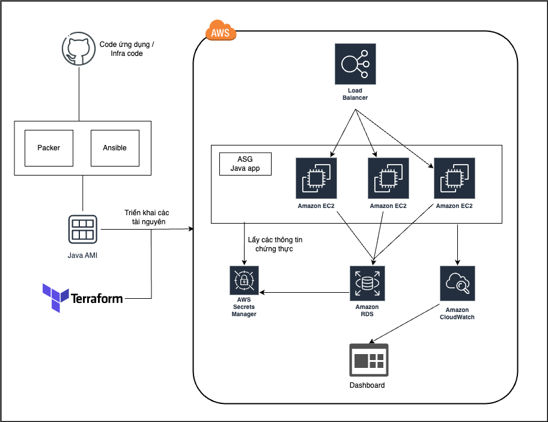

<h1 align="center">
  <br/>
Thiết lập ứng dụng Java có thể Scale với ASG, ALB và RDS trên môi trường AWS dùng Terraform
</h1>
<p align="center"><br/>Tập trung vào việc ứng dụng tool <b>DevOps</b>.</p>

<p align="center"><a href="https://www.terraform.io/" target="_blank"></a>&nbsp;<a href="https://www.ansible.com/" target="_blank"></a>&nbsp;<a href="https://aws.amazon.com/" target="_blank"></a></p>

<p align="center">
    <b>Ngôn ngữ được dùng</b>
    <a href="README-vi.md">Tiếng việt</a>
</p>

# Tổng quan dự án

Dự án này tập trung vào việc tự động hóa quá trình triển khai và quản lý một ứng dụng Java trên nền tảng AWS (Amazon Web Services). Để đạt được mục tiêu này, chúng ta sử dụng các công cụ như Packer, Ansible, và Terraform để tạo và quản lý một môi trường linh hoạt, có khả năng mở rộng và dễ dàng duy trì.

# Mục Tiêu của Dự Án:

## Tự Động Hóa Triển Khai Ứng Dụng Java:

Sử dụng Packer để tạo image AMI chứa ứng dụng java. Sau đó, 
Ansible được sử dụng để cấu hình máy ảo và triển khai ứng dụng vào các máy ảo này.

## Quản Lý Hạ Tầng với Terraform:

Chúng ta sẽ sử dụng Terraform để triển khai và quản lý hạ tầng AWS, bao gồm mạng VPC, subnet, và các dịch vụ như RDS, ALB (Application Load Balancer), và ASG (Auto Scaling Group).

## Tích Hợp với Dịch Vụ AWS:

- Dùng các dịch vụ AWS như RDS để lưu trữ database.
- Dùng ALB để cân bằng tải đến các máy ảo chứa app.
- Dùng ASG để tự động scale số lượng máy ảo theo nhu cầu.

# Cấu trúc các file dự án
Ngoài source code của ứng dụng java, thì project sẽ còn chứa các thư mục và file với cấu trúc như sau:
```
Terraform-Scalable-Java-Application-on-AWS/
├── README.md
├── ansible
│   ├── files
│   │   ├── application.properties
│   │   ├── properties.py
│   │   └── start.sh
│   ├── java-app.pkr.hcl
│   ├── java-app.yml
│   ├── roles
│   │   └── java
│   │       └── tasks
│   │           ├── app.yml
│   │           ├── backends.yml
│   │           ├── cloudwatch.yml
│   │           ├── java.yml
│   │           ├── main.yml
│   │           └── python.yml
│   └── templates
│       ├── config.json.j2
│       └── index.html.j2
└── terraform
    ├── alb-asg
    │   ├── main.tf
    │   ├── terraform.tfstate
    │   ├── terraform.tfstate.backup
    │   └── variable.tf
    ├── modules
    │   ├── alb-asg
    │   │   ├── alb.tf
    │   │   ├── asg.tf
    │   │   ├── iam-policy.tf
    │   │   └── variable.tf
    │   └── rds
    │       ├── main.tf
    │       ├── outputs.tf
    │       └── variables.tf
    ├── rds
    │   ├── main.tf
    │   ├── terraform.tfstate
    │   ├── terraform.tfstate.backup
    │   └── variables.tf
    └── vars
        ├── alb-asg.tfvars
        └── rds.tfvars
```

# Tạo cơ sở hạ tầng trên AWS với Terraform

Bạn sẽ cần cài đặt:
- Packer: Công cụ để tạo máy ảo hình ảnh AMI trên AWS.
- Ansible: Hệ thống quản lý cấu hình và triển khai ứng dụng.
- Terraform: Công cụ tự động hóa triển khai và quản lý hạ tầng hạ tầng hạ tầng.
- JDK-17: Java Development Kit phiên bản 17.
- Maven-v3.9.4: Công cụ quản lý dự án Java.
- AWS CLI: Đã cấu hình với quyền admin trong khu vực us-west-2.
# Các bước Thực Hiện Dự Án:
## Xây Dựng Ứng Dụng Java:
Chúng ta sử dụng Maven để xây dựng ứng dụng Java từ mã nguồn có sẵn trên GitHub. Sau đó tạo file JAR cho ứng dụng và triển Khai AMI cho Ứng Dụng Java:
- Sử dụng Packer để tạo AMI chứa ứng dụng Java và cấu hình tương ứng.
- Ansible được sử dụng để tự động hóa quá trình triển khai ứng dụng.

## Triển Khai RDS Database:
Dùng Terraform để triển khai và quản lý RDS database.
Lưu trữ thông tin kết nối RDS trong AWS Secrets Manager và Parameter Store.
## Triển Khai ALB và ASG:
Dùng Terraform để triển khai và quản lý Application Load Balancer (ALB) và Auto Scaling Group (ASG) và kết nối các máy ảo với RDS database.

# Quá trình thực hiện dự án

## Xây Dựng Ứng Dụng Java - triển khai AMI:
Chúng ta sẽ tập trung vào xây dựng ứng dụng Java và chuẩn bị cho quá trình triển khai trên môi trường AWS.

```
mvn clean install
```
Di chuyển vào thư mục code của ứng dụng và chạy lệnh trên để sử dụng Maven xây dựng ứng dụng Java.
> `mvn clean install` sẽ xóa các phiên bản trước đó, tạo và thực thi các bài test, và cuối cùng là đóng gói ứng dụng thành file JAR.

Sau khi quá trình xây dựng hoàn tất, một thư mục có tên `target` sẽ được tạo ra trong thư mục gốc của dự án. Di chuyển vào thư mục `target` để kiểm tra và sử dụng file JAR của ứng dụng.

Trước khi tạo Amazon Machine Image (AMI) cho ứng dụng, chúng ta cần chuẩn bị một số file và cấu hình.

## cấu hình file `java-app.yml`:

Sao chép file JAR đã được xây dựng vào thư mục `ansible/files`.
Chúng ta sẽ cấu hình file `ansible/java-app.yml` như sau:

```
---
- name: Install Java
  hosts: all
  become: yes
  remote_user: ubuntu

  vars:
    source_dir: files
    dest_dir: /home/ubuntu/
    files:
      - properties.py
      - start.sh
      - spring-petclinic-3.2.0-SNAPSHOT.jar
  roles:
    - java
```
>`playbook` này có nhiệm vụ cài đặt Java trên các máy chủ được xác định, sao chép một số file từ máy chủ nguồn đến máy chủ đích, và sử dụng một role có tên là java để thực hiện các công việc cụ thể liên quan đến cài đặt và cấu hình Java trên máy chủ.


## cấu hình file `properties.py`:
Tệp `ansible/files/properties.py` được cấu hình như những dòng này

```
import boto3
import json

region = 'us-west-2'
parameter_store = '/dev/petclinic/rds_endpoint'
secret_name_tag = 'dev-rds-db'
file_path = "/opt/application.properties"

ssm = boto3.client('ssm', region_name=region)

rds_endpoint = ssm.get_parameter(Name=parameter_store)['Parameter']['Value']

secrets_client = boto3.client('secretsmanager', region_name=region)

secrets_list = secrets_client.list_secrets()
secret_arn = None
for secret in secrets_list['SecretList']:
    if 'Tags' in secret:
        for tag in secret['Tags']:
            if tag['Key'] == 'Name' and tag['Value'] == secret_name_tag:
                secret_arn = secret['ARN']
                break

if secret_arn is None:
    print(f"Secret with name tag '{secret_name_tag}' not found.")
    exit(1)

response = secrets_client.get_secret_value(SecretId=secret_arn)
secret_value = response['SecretString']

secret_data = json.loads(secret_value)

with open(file_path, 'r') as f:
    file_contents = f.read()

file_contents = file_contents.replace("spring.datasource.url=jdbc:mysql://localhost:3306/petclinic", f"spring.datasource.url=jdbc:mysql://{rds_endpoint}")
file_contents = file_contents.replace("spring.datasource.username=petclinic", f"spring.datasource.username={secret_data['username']}")
file_contents = file_contents.replace("spring.datasource.password=petclinic", f"spring.datasource.password={secret_data['password']}")


with open(file_path, 'w') as f:
        f.write(file_contents)
```
> Đầu tiên, sử dụng thư viện `boto3` để tương tác với các dịch vụ AWS như `Systems Manager (SSM)` và `Secrets Manager`. Trong đoạn mã này, nó thực hiện các bước sau:

> Sử dụng `ssm client` để lấy giá trị của tham số từ Parameter Store. Thông tin như địa chỉ kết nối (endpoint) của cơ sở dữ liệu RDS được lưu trữ trong Parameter Store.

>Sử dụng `secretsmanager` client để liệt kê tất cả các secret có sẵn trong Secrets Manager. Tìm kiếm secret cần thiết dựa trên các thẻ (tags) được gán cho secret, đặc biệt là thẻ có key là 'Name' và giá trị tương ứng với `'dev-rds-db'`.

> Đọc nội dung của tệp cấu hình ứng dụng (application.properties). Thay thế các thông tin cấu hình như URL kết nối đến cơ sở dữ liệu, tên người dùng và mật khẩu trong tệp application.properties với thông tin mới lấy từ `SSM và Secrets Manager`.

Kết quả là, tệp `properties.py` đảm bảo rằng thông tin nhạy cảm như địa chỉ kết nối và thông tin đăng nhập vào cơ sở dữ liệu RDS được an toàn và động dựa trên giá trị thực tế được lưu trữ trong các dịch vụ quản lý của AWS.

Coming soon...


